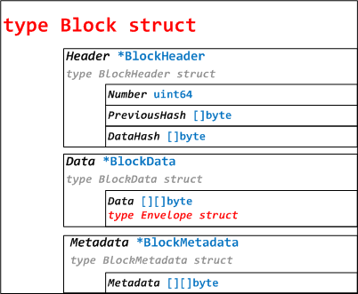

# Fabric 1.0源代码笔记 之 附录-关键数据结构（图）

## 1、Block（块）

Block更详细内容，参考：[Fabric 1.0源代码笔记 之 blockfile（区块文件存储）](../code/blockfile/README.md)

## 2、Envelope（交易封装）

Envelope更详细内容，参考：[Fabric 1.0源代码笔记 之 Tx（Transaction 交易）](../code/tx/README.md)

## 3、TxRwSet（读写集）

TxRwSet更详细内容，参考：[Fabric 1.0源代码笔记 之 Tx #RWSet（读写集）](../code/tx/rwset.md)

## 4、Proposal（提案）

Proposal更详细内容，参考：[Fabric 1.0源代码笔记 之 Proposal（提案）](../code/proposal/README.md)