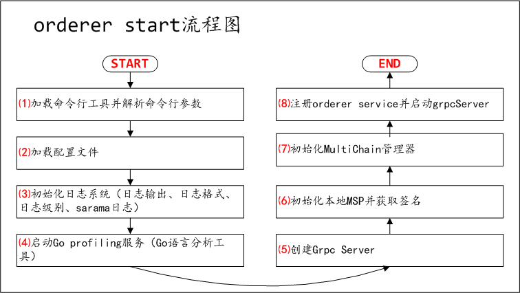
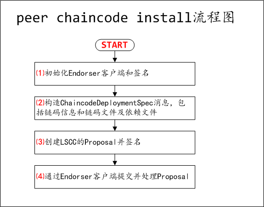
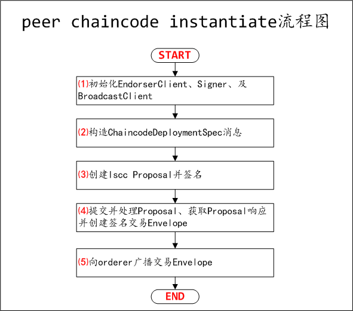
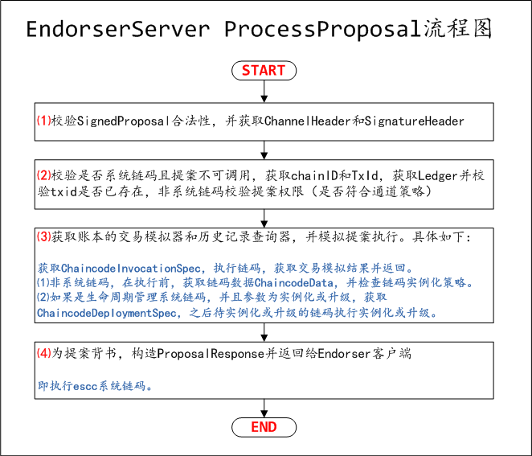

# Fabric 1.0源代码笔记 之 附录-关键流程图（图）

## 1、peer node start流程图

peer node start更详细内容，参考：[Fabric 1.0源代码笔记 之 Peer（2）peer node start命令实现](../peer/peer_node_start.md)

## 2、orderer start流程图

orderer start更详细内容，参考：[Fabric 1.0源代码笔记 之 Orderer（1）orderer start命令实现](../orderer/orderer_start.md)

## 3、peer chaincode流程图

peer chaincode更详细内容，参考：[Fabric 1.0源代码笔记 之 Peer（4）peer chaincode命令及子命令实现](../peer/peer_chaincode.md)

### 3.1、peer chaincode install流程图

### 3.2、peer chaincode instantiate流程图

### 3.3、peer chaincode invoke(query)流程图

.png)

### 4、EndorserServer ProcessProposal流程图

EndorserServer ProcessProposal更详细内容，参考：[Fabric 1.0源代码笔记 之 Peer（7）EndorserServer（Endorser服务端）](../peer/EndorserServer.md)
