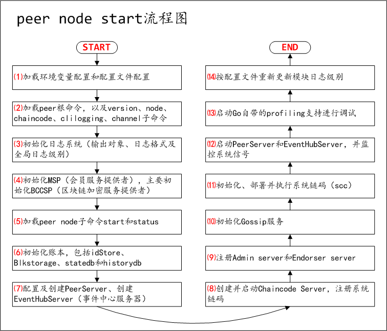

# Fabric 1.0源代码笔记 之 附录-关键流程图（图）

## 1、peer node start流程图

## 2、orderer start流程图

## 3、peer chaincode流程图

### 3.1、peer chaincode install流程图

### 3.2、peer chaincode instantiate流程图

### 3.3、peer chaincode invoke(query)流程图

.png)
