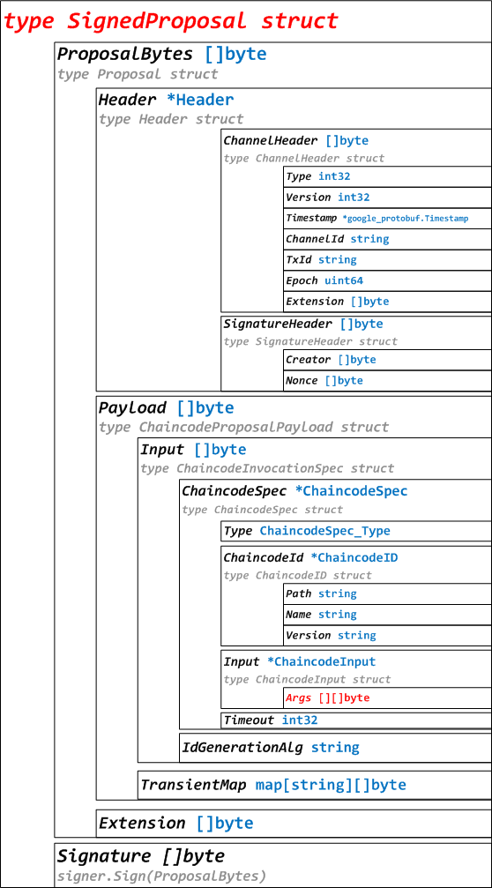

# Fabric 1.0源代码笔记 之 Proposal（提案）

## 1、Proposal概述

Proposal，即向Endorser发起的提案。
Proposal代码分布在protos/utils、protos/peer目录下，目录结构如下：

protos/utils目录：
	proputils.go，Proposal工具函数。
	txutils.go，Proposal工具函数。
protos/peer目录：
	proposal.pb.go，Proposal相关结构体定义。

## 2、Proposal相关结构体定义



### 2.1、SignedProposal定义

```go
type SignedProposal struct {
	ProposalBytes []byte //Proposal序列化，即type Proposal struct
	Signature []byte //signer.Sign(ProposalBytes)
}
//代码在protos/peer/proposal.pb.go
```

### 2.2、Proposal定义

```go
type Proposal struct {
	Header []byte //Header序列化，即type Header struct
	Payload []byte //ChaincodeProposalPayload序列化，即type ChaincodeProposalPayload struct
	Extension []byte //扩展
}
//代码在protos/peer/proposal.pb.go
```

Header更详细内容，参考：[Fabric 1.0源代码笔记 之 Tx（Transaction 交易）](../tx/README.md)

### 2.3、ChaincodeProposalPayload定义

```go
type ChaincodeProposalPayload struct {
	Input []byte //ChaincodeInvocationSpec序列化，即type ChaincodeInvocationSpec struct
	TransientMap map[string][]byte //瞬态映射
}
//代码在protos/peer/proposal.pb.go
```

ChaincodeInvocationSpec更详细内容，参考：[Fabric 1.0源代码笔记 之 Chaincode（链码）](../chaincode/README.md)

## 3、ProposalResponse结构体定义

### 3.1、ProposalResponse定义

```go
type ProposalResponse struct {
	Version int32
	Timestamp *google_protobuf1.Timestamp
	Response *Response //type Response struct，peer.Response{Status: 200, Message: "OK"}}
	Payload []byte
	Endorsement *Endorsement //type Endorsement struct
}
//代码在protos/peer/proposal_response.pb.go
```

### 3.2、Response定义

```go
type Response struct { //peer.Response{Status: 200, Message: "OK"}}
	Status int32
	Message string
	Payload []byte
}
//代码在protos/peer/proposal_response.pb.go
```

### 3.3、Endorsement定义

```go
type Endorsement struct {
	Endorser []byte //bccspmsp.signer
	Signature []byte
}
//代码在protos/peer/proposal_response.pb.go
```