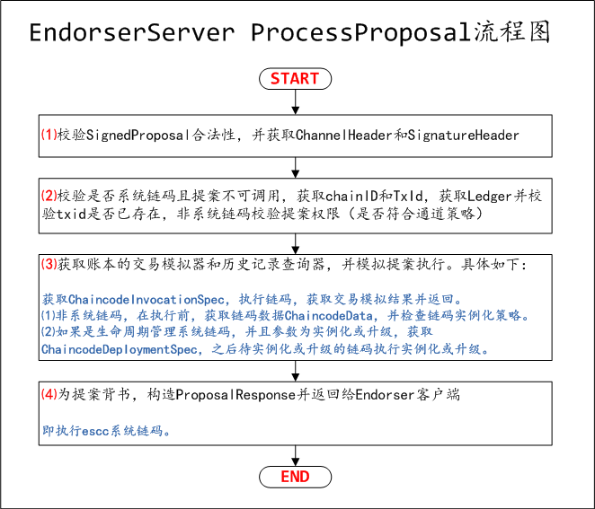

# Fabric 1.0源代码笔记 之 Peer（8）EndorserServer（Endorser服务端）

## 1、EndorserServer概述

EndorserServer相关代码在protos/peer、core/endorser目录下。

* protos/peer/peer.pb.go，EndorserServer接口定义。
* core/endorser/endorser.go，EndorserServer接口实现，即Endorser结构体及方法，以及Endorser服务端ProcessProposal处理流程。

## 2、EndorserServer接口定义

### 2.1、EndorserServer接口定义

```go
type EndorserServer interface {
	ProcessProposal(context.Context, *SignedProposal) (*ProposalResponse, error)
}
//代码在protos/peer/peer.pb.go
```

### 2.2、gRPC相关实现

```go
var _Endorser_serviceDesc = grpc.ServiceDesc{
	ServiceName: "protos.Endorser",
	HandlerType: (*EndorserServer)(nil),
	Methods: []grpc.MethodDesc{
		{
			MethodName: "ProcessProposal",
			Handler:    _Endorser_ProcessProposal_Handler,
		},
	},
	Streams:  []grpc.StreamDesc{},
	Metadata: "peer/peer.proto",
}

func RegisterEndorserServer(s *grpc.Server, srv EndorserServer) {
	s.RegisterService(&_Endorser_serviceDesc, srv)
}

func _Endorser_ProcessProposal_Handler(srv interface{}, ctx context.Context, dec func(interface{}) error, interceptor grpc.UnaryServerInterceptor) (interface{}, error) {
	in := new(SignedProposal)
	if err := dec(in); err != nil {
		return nil, err
	}
	if interceptor == nil {
		return srv.(EndorserServer).ProcessProposal(ctx, in)
	}
	info := &grpc.UnaryServerInfo{
		Server:     srv,
		FullMethod: "/protos.Endorser/ProcessProposal",
	}
	handler := func(ctx context.Context, req interface{}) (interface{}, error) {
		return srv.(EndorserServer).ProcessProposal(ctx, req.(*SignedProposal))
	}
	return interceptor(ctx, in, info, handler)
}
//代码在protos/peer/peer.pb.go
```

## 3、EndorserServer接口实现

### 3.1、Endorser结构体及方法

```go
type Endorser struct {
	policyChecker policy.PolicyChecker //策略检查器
}
//代码在core/endorser/endorser.go
```

涉及方法如下：

```go
//构造Endorser
func NewEndorserServer() pb.EndorserServer
//执行提案
func (e *Endorser) ProcessProposal(ctx context.Context, signedProp *pb.SignedProposal) (*pb.ProposalResponse, error)

//检查SignedProposal是否符合通道策略，调用e.policyChecker.CheckPolicy()
func (e *Endorser) checkACL(signedProp *pb.SignedProposal, chdr *common.ChannelHeader, shdr *common.SignatureHeader, hdrext *pb.ChaincodeHeaderExtension) error
//检查Escc和Vscc，暂未实现
func (*Endorser) checkEsccAndVscc(prop *pb.Proposal) error
//获取账本的交易模拟器，调用peer.GetLedger(ledgername).NewTxSimulator()
func (*Endorser) getTxSimulator(ledgername string) (ledger.TxSimulator, error)
//获取账本历史交易查询器，调用peer.GetLedger(ledgername).NewHistoryQueryExecutor()
func (*Endorser) getHistoryQueryExecutor(ledgername string) (ledger.HistoryQueryExecutor, error)
//执行链码
func (e *Endorser) callChaincode(ctxt context.Context, chainID string, version string, txid string, signedProp *pb.SignedProposal, prop *pb.Proposal, cis *pb.ChaincodeInvocationSpec, cid *pb.ChaincodeID, txsim ledger.TxSimulator) (*pb.Response, *pb.ChaincodeEvent, error)
func (e *Endorser) disableJavaCCInst(cid *pb.ChaincodeID, cis *pb.ChaincodeInvocationSpec) error
//通过调用chaincode来模拟提案
func (e *Endorser) simulateProposal(ctx context.Context, chainID string, txid string, signedProp *pb.SignedProposal, prop *pb.Proposal, cid *pb.ChaincodeID, txsim ledger.TxSimulator) (*ccprovider.ChaincodeData, *pb.Response, []byte, *pb.ChaincodeEvent, error)
//从LSCC获取链码数据
func (e *Endorser) getCDSFromLSCC(ctx context.Context, chainID string, txid string, signedProp *pb.SignedProposal, prop *pb.Proposal, chaincodeID string, txsim ledger.TxSimulator) (*ccprovider.ChaincodeData, error)
//提案背书
func (e *Endorser) endorseProposal(ctx context.Context, chainID string, txid string, signedProp *pb.SignedProposal, proposal *pb.Proposal, response *pb.Response, simRes []byte, event *pb.ChaincodeEvent, visibility []byte, ccid *pb.ChaincodeID, txsim ledger.TxSimulator, cd *ccprovider.ChaincodeData) (*pb.ProposalResponse, error)
//提交模拟交易，仅测试使用
func (e *Endorser) commitTxSimulation(proposal *pb.Proposal, chainID string, signer msp.SigningIdentity, pResp *pb.ProposalResponse, blockNumber uint64) error
//代码在core/endorser/endorser.go
```

### 3.2、Endorser服务端ProcessProposal处理流程

Endorser服务端ProcessProposal处理流程，即func (e *Endorser) ProcessProposal(ctx context.Context, signedProp *pb.SignedProposal) (*pb.ProposalResponse, error)方法实现。



#### 3.2.1、校验SignedProposal合法性，并获取ChannelHeader和SignatureHeader

```go
//校验SignedProposal合法性
prop, hdr, hdrExt, err := validation.ValidateProposalMessage(signedProp)
//获取ChannelHeader
chdr, err := putils.UnmarshalChannelHeader(hdr.ChannelHeader)
//获取SignatureHeader
shdr, err := putils.GetSignatureHeader(hdr.SignatureHeader)
//代码在core/endorser/endorser.go
```

validation.ValidateProposalMessage(signedProp)代码如下：

```go
func ValidateProposalMessage(signedProp *pb.SignedProposal) (*pb.Proposal, *common.Header, *pb.ChaincodeHeaderExtension, error) {
	prop, err := utils.GetProposal(signedProp.ProposalBytes) //获取type Proposal struct
	hdr, err := utils.GetHeader(prop.Header) //获取Proposal.Header
	chdr, shdr, err := validateCommonHeader(hdr) //校验Proposal.Header
	//检查来自创建者的签名
	err = checkSignatureFromCreator(shdr.Creator, signedProp.Signature, signedProp.ProposalBytes, chdr.ChannelId)
	//校验交易TxID，TxID由Nonce和Creator构成
	err = utils.CheckProposalTxID(
		chdr.TxId, //ChannelHeader.TxId
		shdr.Nonce, //SignatureHeader.Nonce
		shdr.Creator) //SignatureHeader.Creator

	switch common.HeaderType(chdr.Type) {
	case common.HeaderType_CONFIG:
		fallthrough
	case common.HeaderType_ENDORSER_TRANSACTION:
		//校验ChaincodeHeaderExtension
		chaincodeHdrExt, err := validateChaincodeProposalMessage(prop, hdr)
		return prop, hdr, chaincodeHdrExt, err
	default:
		return nil, nil, nil, fmt.Errorf("Unsupported proposal type %d", common.HeaderType(chdr.Type))
	}
}
//代码在core/common/validation/msgvalidation.go
```

#### 3.2.2、校验是否系统链码且提案不可调用，获取chainID和TxId，获取Ledger并校验txid是否已存在，非系统链码校验提案权限（是否符合通道策略）

```go
//校验是否系统链码且提案不可调用
if syscc.IsSysCCAndNotInvokableExternal(hdrExt.ChaincodeId.Name) {
	//如果是系统链码且提案不可调用
}
//获取chainID，即ChannelId
chainID := chdr.ChannelId
//获取交易TxId
txid := chdr.TxId
if chainID != "" {
	//获取Ledger
	lgr := peer.GetLedger(chainID)
	//校验txid是否已存在
	_, err := lgr.GetTransactionByID(txid)
	//非系统链码校验提案权限（是否符合通道策略）
	if !syscc.IsSysCC(hdrExt.ChaincodeId.Name) {
		err = e.checkACL(signedProp, chdr, shdr, hdrExt)
	}
}
//代码在core/endorser/endorser.go
```

#### 3.2.3、获取账本的交易模拟器和历史记录查询器，并模拟提案执行

```go
var txsim ledger.TxSimulator
var historyQueryExecutor ledger.HistoryQueryExecutor
if chainID != "" {
	//获取账本的交易模拟器
	txsim, err = e.getTxSimulator(chainID)
	//获取历史记录查询器
	historyQueryExecutor, err = e.getHistoryQueryExecutor(chainID)
	//HistoryQueryExecutorKey key = "historyqueryexecutorkey"
	//context.WithValue，将Key与对象建立关系
	ctx = context.WithValue(ctx, chaincode.HistoryQueryExecutorKey, historyQueryExecutor)
}
//模拟提案执行
cd, res, simulationResult, ccevent, err := e.simulateProposal(ctx, chainID, txid, signedProp, prop, hdrExt.ChaincodeId, txsim)
//代码在core/endorser/endorser.go
```

e.simulateProposal(ctx, chainID, txid, signedProp, prop, hdrExt.ChaincodeId, txsim)代码如下：模拟提案执行。

```go
func (e *Endorser) simulateProposal(ctx context.Context, chainID string, txid string, signedProp *pb.SignedProposal, prop *pb.Proposal, cid *pb.ChaincodeID, txsim ledger.TxSimulator) (*ccprovider.ChaincodeData
, *pb.Response, []byte, *pb.ChaincodeEvent, error) {
	//获取ChaincodeInvocationSpec
	cis, err := putils.GetChaincodeInvocationSpec(prop)
	//禁用Java安装、实例化和立即升级
	err = e.disableJavaCCInst(cid, cis)
	//检查Escc和Vscc，暂未实现
	err = e.checkEsccAndVscc(prop)

	var cdLedger *ccprovider.ChaincodeData
	var version string
	if !syscc.IsSysCC(cid.Name) { //非系统链码
		//获取链码数据ChaincodeData
		cdLedger, err = e.getCDSFromLSCC(ctx, chainID, txid, signedProp, prop, cid.Name, txsim)
		//获取链码数据版本
		version = cdLedger.Version
		//检查链码实例化策略
		err = ccprovider.CheckInsantiationPolicy(cid.Name, version, cdLedger)
	} else {
		version = util.GetSysCCVersion() //获取系统链码版本
	}

	var simResult []byte
	var res *pb.Response
	var ccevent *pb.ChaincodeEvent
	//执行链码
	res, ccevent, err = e.callChaincode(ctx, chainID, version, txid, signedProp, prop, cis, cid, txsim)
	if txsim != nil {
		//获取交易模拟结果
		simResult, err = txsim.GetTxSimulationResults()
	}
	return cdLedger, res, simResult, ccevent, nil
}

//代码在core/endorser/endorser.go
```

e.endorseProposal(ctx, chainID, txid, signedProp, prop, res, simulationResult, ccevent, hdrExt.PayloadVisibility, hdrExt.ChaincodeId, txsim, cd)代码如下：为提案背书。

```go
func (e *Endorser) callChaincode(ctxt context.Context, chainID string, version string, txid string, signedProp *pb.SignedProposal, prop *pb.Proposal, cis *pb.ChaincodeInvocationSpec, cid *pb.ChaincodeID, txsim ledger.TxSimulator) (*pb.Response, *pb.ChaincodeEvent, error) {
	var err error
	var res *pb.Response
	var ccevent *pb.ChaincodeEvent
	if txsim != nil {
		//TXSimulatorKey key = "txsimulatorkey"，key与对象建立关系
		ctxt = context.WithValue(ctxt, chaincode.TXSimulatorKey, txsim)
	}
	scc := syscc.IsSysCC(cid.Name) //是否系统链码
	cccid := ccprovider.NewCCContext(chainID, cid.Name, version, txid, scc, signedProp, prop)
	//执行链码
	res, ccevent, err = chaincode.ExecuteChaincode(ctxt, cccid, cis.ChaincodeSpec.Input.Args)
	//如果是生命周期管理系统链码，并且参数为实例化或升级
	if cid.Name == "lscc" && len(cis.ChaincodeSpec.Input.Args) >= 3 && (string(cis.ChaincodeSpec.Input.Args[0]) == "deploy" || string(cis.ChaincodeSpec.Input.Args[0]) == "upgrade") {
		var cds *pb.ChaincodeDeploymentSpec
		//获取ChaincodeDeploymentSpec
		cds, err = putils.GetChaincodeDeploymentSpec(cis.ChaincodeSpec.Input.Args[2])
		//待实例化或升级的链码执行实例化或升级
		cccid = ccprovider.NewCCContext(chainID, cds.ChaincodeSpec.ChaincodeId.Name, cds.ChaincodeSpec.ChaincodeId.Version, txid, false, signedProp, prop)
		_, _, err = chaincode.Execute(ctxt, cccid, cds)
	}
	return res, ccevent, err
}
//代码在core/endorser/endorser.go
```

Chaincode更详细内容，参考：[Fabric 1.0源代码笔记 之 Chaincode（链码）](../chaincode/README.md)


#### 3.2.4、为提案背书，构造ProposalResponse并返回给Endorser客户端

```go
var pResp *pb.ProposalResponse
//为提案背书，即调取escc系统链码
pResp, err = e.endorseProposal(ctx, chainID, txid, signedProp, prop, res, simulationResult, ccevent, hdrExt.PayloadVisibility, hdrExt.ChaincodeId, txsim, cd)
pResp.Response.Payload = res.Payload
return pResp, nil
//代码在core/endorser/endorser.go
```

e.endorseProposal(ctx, chainID, txid, signedProp, prop, res, simulationResult, ccevent, hdrExt.PayloadVisibility, hdrExt.ChaincodeId, txsim, cd)代码如下：

```go
func (e *Endorser) endorseProposal(ctx context.Context, chainID string, txid string, signedProp *pb.SignedProposal, proposal *pb.Proposal, response *pb.Response, simRes []byte, event *pb.ChaincodeEvent, visibility []byte, ccid *pb.ChaincodeID, txsim ledger.TxSimulator, cd *ccprovider.ChaincodeData) (*pb.ProposalResponse, error) {
	isSysCC := cd == nil
	var escc string
	if isSysCC {
		escc = "escc"
	} else {
		escc = cd.Escc
	}

	var err error
	var eventBytes []byte
	if event != nil {
		eventBytes, err = putils.GetBytesChaincodeEvent(event)
	}

	resBytes, err := putils.GetBytesResponse(response)
	if isSysCC {
		ccid.Version = util.GetSysCCVersion()
	} else {
		ccid.Version = cd.Version
	}

	ccidBytes, err := putils.Marshal(ccid)
	args := [][]byte{[]byte(""), proposal.Header, proposal.Payload, ccidBytes, resBytes, simRes, eventBytes, visibility}
	version := util.GetSysCCVersion()
	ecccis := &pb.ChaincodeInvocationSpec{ChaincodeSpec: &pb.ChaincodeSpec{Type: pb.ChaincodeSpec_GOLANG, ChaincodeId: &pb.ChaincodeID{Name: escc}, Input: &pb.ChaincodeInput{Args: args}}}
	//执行escc系统链码
	res, _, err := e.callChaincode(ctx, chainID, version, txid, signedProp, proposal, ecccis, &pb.ChaincodeID{Name: escc}, txsim)
	prBytes := res.Payload
	pResp, err := putils.GetProposalResponse(prBytes)
	return pResp, nil
}

//代码在core/endorser/endorser.go
```