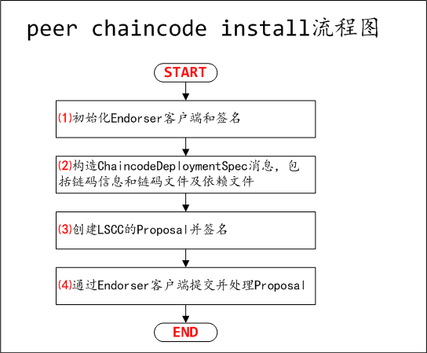

# Fabric 1.0源代码笔记 之 Peer（4）peer chaincode命令及子命令实现

## 1、peer chaincode install子命令实现（安装链码）

### 1.0、peer chaincode install子命令概述

peer chaincode install，将链码的源码和环境封装为一个链码安装打包文件，并传输到背书节点。

peer chaincode install支持如下两种方式：
* 指定代码方式，peer chaincode install -n <链码名称> -v <链码版本> -p <链码路径>
* 基于链码打包文件方式，peer chaincode install <链码打包文件>



### 1.1、初始化Endorser客户端

```go
cf, err = InitCmdFactory(true, false)
//代码在peer/chaincode/install.go
```

cf, err = InitCmdFactory(true, false)代码如下：

```go
func InitCmdFactory(isEndorserRequired, isOrdererRequired bool) (*ChaincodeCmdFactory, error) {
	var err error
	var endorserClient pb.EndorserClient
	if isEndorserRequired {
		//获取Endorser客户端
		endorserClient, err = common.GetEndorserClientFnc() //func GetEndorserClient() (pb.EndorserClient, error)
	}
	//获取签名
	signer, err := common.GetDefaultSignerFnc()
	var broadcastClient common.BroadcastClient
	if isOrdererRequired {
		//此处未用到，暂略
	}
	//构造ChaincodeCmdFactory
	return &ChaincodeCmdFactory{
		EndorserClient:  endorserClient,
		Signer:          signer,
		BroadcastClient: broadcastClient,
	}, nil
}
//代码在peer/chaincode/common.go
```

### 1.2、构造ChaincodeDeploymentSpec消息（链码信息及链码文件打包）

```go
if ccpackfile == "" { //指定代码方式，重新构造构造ChaincodeDeploymentSpec消息
	ccpackmsg, err = genChaincodeDeploymentSpec(cmd, chaincodeName, chaincodeVersion)
} else { //基于链码打包文件方式，直接读取ChaincodeDeploymentSpec消息
	var cds *pb.ChaincodeDeploymentSpec
	ccpackmsg, cds, err = getPackageFromFile(ccpackfile)
}
//代码在peer/chaincode/install.go
```

ccpackmsg, err = genChaincodeDeploymentSpec(cmd, chaincodeName, chaincodeVersion)代码如下：

```go
func genChaincodeDeploymentSpec(cmd *cobra.Command, chaincodeName, chaincodeVersion string) (*pb.ChaincodeDeploymentSpec, error) {
	//已经存在，直接报错
	if existed, _ := ccprovider.ChaincodePackageExists(chaincodeName, chaincodeVersion); existed {
		return nil, fmt.Errorf("chaincode %s:%s already exists", chaincodeName, chaincodeVersion)
	}
	spec, err := getChaincodeSpec(cmd)
	cds, err := getChaincodeDeploymentSpec(spec, true)
	return cds, nil
}
//代码在peer/chaincode/install.go
```

spec, err := getChaincodeSpec(cmd)代码如下：

```go
func getChaincodeSpec(cmd *cobra.Command) (*pb.ChaincodeSpec, error) {
	spec := &pb.ChaincodeSpec{}
	err := checkChaincodeCmdParams(cmd) //检查参数合法性
	input := &pb.ChaincodeInput{}
	//flags.StringVarP(&chaincodeCtorJSON, "ctor", "c", "{}"，ctor为链码具体执行参数信息，默认为{}
	err := json.Unmarshal([]byte(chaincodeCtorJSON), &input)
	//flags.StringVarP(&chaincodeLang, "lang", "l", "golang"，lang为链码的编写语言，默认为golang
	chaincodeLang = strings.ToUpper(chaincodeLang)
	spec = &pb.ChaincodeSpec{
		Type:        pb.ChaincodeSpec_Type(pb.ChaincodeSpec_Type_value[chaincodeLang]),
		ChaincodeId: &pb.ChaincodeID{Path: chaincodePath, Name: chaincodeName, Version: chaincodeVersion},
		Input:       input,
	}
	return spec, nil
}
//代码在peer/chaincode/common.go
```

cds, err := getChaincodeDeploymentSpec(spec, true)代码如下：

```go
func getChaincodeDeploymentSpec(spec *pb.ChaincodeSpec, crtPkg bool) (*pb.ChaincodeDeploymentSpec, error) {
	var codePackageBytes []byte
	if chaincode.IsDevMode() == false && crtPkg {
		var err error
		err = checkSpec(spec) //检查spec合法性
		codePackageBytes, err = container.GetChaincodePackageBytes(spec) //打包链码文件及依赖文件
	}
	//构造ChaincodeDeploymentSpec
	chaincodeDeploymentSpec := &pb.ChaincodeDeploymentSpec{ChaincodeSpec: spec, CodePackage: codePackageBytes}
	return chaincodeDeploymentSpec, nil
//代码在peer/chaincode/common.go
```

### 1.3、创建lscc Proposal并签名

```go
creator, err := cf.Signer.Serialize() //获取签名者
//按ChaincodeDeploymentSpec构造Proposal，即链码ChaincodeDeploymentSpec消息作为参数传递给lscc系统链码并调用
//调用createProposalFromCDS(chainID, cds, creator, policy, escc, vscc, "deploy")
prop, _, err := utils.CreateInstallProposalFromCDS(msg, creator) 
var signedProp *pb.SignedProposal
signedProp, err = utils.GetSignedProposal(prop, cf.Signer) //签名提案
//代码在peer/chaincode/install.go
```

createProposalFromCDS(chainID, cds, creator, policy, escc, vscc, "deploy")代码如下：

```go
func createProposalFromCDS(chainID string, msg proto.Message, creator []byte, policy []byte, escc []byte, vscc []byte, propType string) (*peer.Proposal, string, error) {
	var ccinp *peer.ChaincodeInput
	var b []byte
	var err error
	b, err = proto.Marshal(msg)
	switch propType {
	case "deploy":
		fallthrough
	case "upgrade": 
		cds, ok := msg.(*peer.ChaincodeDeploymentSpec)
		ccinp = &peer.ChaincodeInput{Args: [][]byte{[]byte(propType), []byte(chainID), b, policy, escc, vscc}}
	case "install": 
		ccinp = &peer.ChaincodeInput{Args: [][]byte{[]byte(propType), b}}
	}
	lsccSpec := &peer.ChaincodeInvocationSpec{ //构造lscc ChaincodeInvocationSpec
		ChaincodeSpec: &peer.ChaincodeSpec{
			Type:        peer.ChaincodeSpec_GOLANG,
			ChaincodeId: &peer.ChaincodeID{Name: "lscc"},
			Input:       ccinp}}

	return CreateProposalFromCIS(common.HeaderType_ENDORSER_TRANSACTION, chainID, lsccSpec, creator)
}
//代码在protos/utils/proputils.go
```

### 1.4、提交并处理Proposal

```go
proposalResponse, err := cf.EndorserClient.ProcessProposal(context.Background(), signedProp)
//代码在peer/chaincode/install.go
```

## 2、peer chaincode instantiate子命令实现（实例化链码）

### 2.0、peer chaincode instantiate概述

peer chaincode instantiate命令通过构造生命周期管理系统链码（LSCC）的交易，将安装过的链码在指定通道上进行实例化调用。
在peer上创建容器启动，并执行初始化操作。

### 2.1、初始化EndorserClient、Signer、及BroadcastClient

与2.1接近，附BroadcastClient初始化代码如下：

```go
cf, err = InitCmdFactory(true, true)
//代码在peer/chaincode/instantiate.go
```

```go
func InitCmdFactory(isEndorserRequired, isOrdererRequired bool) (*ChaincodeCmdFactory, error) {
	//初始化EndorserClient、Signer，略，参考1.1
	var broadcastClient common.BroadcastClient
	if isOrdererRequired {
		//flags.StringVarP(&orderingEndpoint, "orderer", "o", "", "Ordering service endpoint")
		//orderingEndpoint为orderer服务地址
		broadcastClient, err = common.GetBroadcastClientFnc(orderingEndpoint, tls, caFile)
	}
}
//代码在peer/chaincode/common.go
```

BroadcastClient更详细内容，参考[Fabric 1.0源代码笔记 之 Peer（6）BroadcastClient（Broadcast客户端）](BroadcastClient.md)