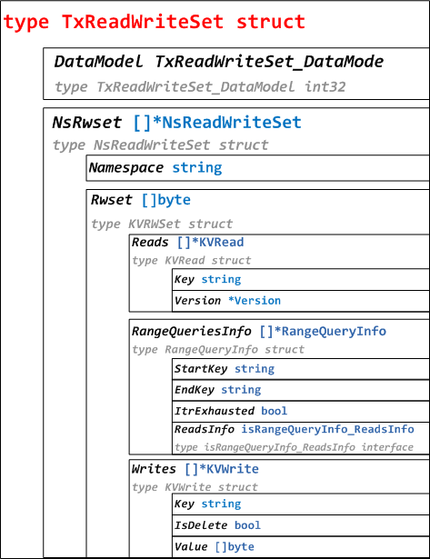

# Fabric 1.0源代码笔记 之 Tx（1）RWSet（读写集）

## 1、RWSet概述

在背书节点模拟Transaction期间，为交易准备了一个读写集合。
Read Set包含模拟Transaction读取的Key和版本的列表，Write Set包含Key、写入的新值、以及删除标记（是否删除Key）。

RWSet相关代码分布在protos/ledger/rwset、core/ledger/kvledger/txmgmt/rwsetutil目录下。目录结构如下：

* protos/ledger/rwset目录：
	* rwset.pb.go，TxReadWriteSet和NsReadWriteSet结构体定义。
	* kv_rwset.pb.go，KVRWSet、KVRead、KVWrite、Version、RangeQueryInfo结构体定义，以及isRangeQueryInfo_ReadsInfo接口定义。
* core/ledger/kvledger/txmgmt/rwsetutil目录：
	* rwset_proto_util.go，TxRwSet和NsRwSet结构体及方法。

## 2、TxReadWriteSet结构体（protos）



TxReadWriteSet结构体：

```go
type TxReadWriteSet_DataModel int32
const (
	TxReadWriteSet_KV TxReadWriteSet_DataModel = 0
)

type TxReadWriteSet struct {
	DataModel TxReadWriteSet_DataModel
	NsRwset   []*NsReadWriteSet
}

type NsReadWriteSet struct {
	Namespace string
	Rwset     []byte //KVRWSet 序列化
}
//代码在protos/ledger/rwset/rwset.pb.go
```

KVRWSet结构体：

```go
type KVRWSet struct {
	Reads            []*KVRead
	RangeQueriesInfo []*RangeQueryInfo
	Writes           []*KVWrite
}

type KVRead struct {
	Key     string
	Version *Version
}

type KVWrite struct {
	Key      string
	IsDelete bool
	Value    []byte
}

type Version struct {
	BlockNum uint64
	TxNum    uint64
}

type RangeQueryInfo struct {
	StartKey     string
	EndKey       string
	ItrExhausted bool
	ReadsInfo isRangeQueryInfo_ReadsInfo
}
代码在protos/ledger/rwset/kvrwset/kv_rwset.pb.go
```

## 3、TxRwSet结构体及方法（core）


```go
type TxRwSet struct {
	NsRwSets []*NsRwSet
}

type NsRwSet struct {
	NameSpace string
	KvRwSet   *kvrwset.KVRWSet
}
//[]byte反序列化后构造NsRwSet，加入NsRwSets
func (txRwSet *TxRwSet) ToProtoBytes() ([]byte, error)
func (txRwSet *TxRwSet) FromProtoBytes(protoBytes []byte) error
func NewKVRead(key string, version *version.Height) *kvrwset.KVRead
func NewVersion(protoVersion *kvrwset.Version) *version.Height
func newProtoVersion(height *version.Height) *kvrwset.Version
func newKVWrite(key string, value []byte) *kvrwset.KVWrite
//代码在core/ledger/kvledger/txmgmt/rwsetutil/rwset_proto_util.go
```


