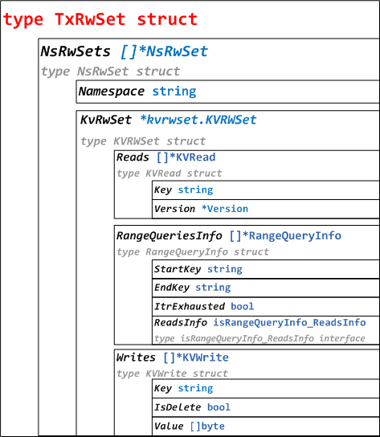

# Fabric 1.0源代码笔记 之 Tx #RWSet（读写集）

## 1、RWSet概述

在背书节点模拟Transaction期间，为交易准备了一个读写集合。
Read Set包含模拟Transaction读取的Key和版本的列表，Write Set包含Key、写入的新值、以及删除标记（是否删除Key）。

RWSet相关代码分布在protos/ledger/rwset、core/ledger/kvledger/txmgmt/rwsetutil目录下。目录结构如下：

* protos/ledger/rwset目录：
	* rwset.pb.go，TxReadWriteSet和NsReadWriteSet结构体定义。
	* kv_rwset.pb.go，KVRWSet、KVRead、KVWrite、Version、RangeQueryInfo结构体定义，以及isRangeQueryInfo_ReadsInfo接口定义。
* core/ledger/kvledger/txmgmt/rwsetutil目录：
	* rwset_proto_util.go，TxRwSet和NsRwSet结构体及方法。
	* rwset_builder.go，RWSetBuilder结构体及方法。
	* query_results_helper.go，RangeQueryResultsHelper结构体及方法。

## 2、TxReadWriteSet结构体（protos）


TxReadWriteSet结构体：

```go
type TxReadWriteSet_DataModel int32
const (
	TxReadWriteSet_KV TxReadWriteSet_DataModel = 0
)

type TxReadWriteSet struct {
	DataModel TxReadWriteSet_DataModel
	NsRwset   []*NsReadWriteSet
}

type NsReadWriteSet struct {
	Namespace string
	Rwset     []byte //KVRWSet 序列化
}
//代码在protos/ledger/rwset/rwset.pb.go
```

KVRWSet结构体：

```go
type KVRWSet struct {
	Reads            []*KVRead
	RangeQueriesInfo []*RangeQueryInfo
	Writes           []*KVWrite
}

type KVRead struct {
	Key     string
	Version *Version
}

type KVWrite struct {
	Key      string
	IsDelete bool
	Value    []byte
}

type Version struct {
	BlockNum uint64
	TxNum    uint64
}

type RangeQueryInfo struct {
	StartKey     string
	EndKey       string
	ItrExhausted bool
	ReadsInfo isRangeQueryInfo_ReadsInfo
}
代码在protos/ledger/rwset/kvrwset/kv_rwset.pb.go
```

## 3、TxRwSet结构体及方法（core）



```go
type TxRwSet struct {
	NsRwSets []*NsRwSet
}

type NsRwSet struct {
	NameSpace string
	KvRwSet   *kvrwset.KVRWSet
}

//按TxRwSet构造TxReadWriteSet并序列化
func (txRwSet *TxRwSet) ToProtoBytes() ([]byte, error)
//[]byte反序列化为TxReadWriteSet，按TxReadWriteSet构造TxRwSet
func (txRwSet *TxRwSet) FromProtoBytes(protoBytes []byte) error
//构造KVRead
func NewKVRead(key string, version *version.Height) *kvrwset.KVRead
//构造version.Height
func NewVersion(protoVersion *kvrwset.Version) *version.Height
//构造Version
func newProtoVersion(height *version.Height) *kvrwset.Version
//构造KVWrite
func newKVWrite(key string, value []byte) *kvrwset.KVWrite
//代码在core/ledger/kvledger/txmgmt/rwsetutil/rwset_proto_util.go
```

## 4、RWSetBuilder结构体及方法

RWSetBuilder结构体定义：

```go
type RWSetBuilder struct {
	rwMap map[string]*nsRWs //Namespace
}

type nsRWs struct {
	readMap          map[string]*kvrwset.KVRead //KVRead map
	writeMap         map[string]*kvrwset.KVWrite //KVWrite map
	rangeQueriesMap  map[rangeQueryKey]*kvrwset.RangeQueryInfo //RangeQueryInfo map
	rangeQueriesKeys []rangeQueryKey //rangeQueryKey数组
}

type rangeQueryKey struct {
	startKey     string
	endKey       string
	itrExhausted bool //迭代器是否用尽
}
//代码在core/ledger/kvledger/txmgmt/rwsetutil/rwset_builder.go
```

涉及方法如下：

```go
//构造nsRWs
func newNsRWs() *nsRWs
//构造RWSetBuilder
func NewRWSetBuilder() *RWSetBuilder
//构造KVRead，并加入nsRWs.readMap
func (rws *RWSetBuilder) AddToReadSet(ns string, key string, version *version.Height)
//构造KVWrite，并加入nsRWs.writeMap
func (rws *RWSetBuilder) AddToWriteSet(ns string, key string, value []byte)
//用RangeQueryInfo构造rangeQueryKey，并将rangeQueryKey和RangeQueryInfo加入nsRWs.rangeQueriesKeys和nsRWs.rangeQueriesMap
func (rws *RWSetBuilder) AddToRangeQuerySet(ns string, rqi *kvrwset.RangeQueryInfo)
从RWSetBuilder构造TxRwSet
func (rws *RWSetBuilder) GetTxReadWriteSet() *TxRwSet
//获取或创建nsRWs
func (rws *RWSetBuilder) getOrCreateNsRW(ns string) *nsRWs
//代码在core/ledger/kvledger/txmgmt/rwsetutil/rwset_builder.go
```

## 5、RangeQueryResultsHelper结构体及方法（**什么用途呢？？？**）

### 5.1、merkleTree（默克尔树）

Merkle Tree，也称Hash Tree，即存储hash值的一棵树。
Merkle树的叶子是数据块的hash值，非叶节点是其对应子节点串联字符串的hash。

```go
type MerkleTreeLevel uint32
type Hash []byte
const leafLevel = MerkleTreeLevel(1)

type merkleTree struct {
	tree      map[MerkleTreeLevel][]Hash
	maxLevel  MerkleTreeLevel //1
	maxDegree uint32 //单层最大个数
}
//代码在core/ledger/kvledger/txmgmt/rwsetutil/query_results_helper.go
```

涉及方法如下：

```go
//构造merkleTree
func newMerkleTree(maxDegree uint32) (*merkleTree, error) 
//加入哈希，从第一层开始加，直至当前层哈希数量没有超过限额为止
func (m *merkleTree) update(nextLeafLevelHash Hash) error 
func (m *merkleTree) done() error 
func (m *merkleTree) getSummery() *kvrwset.QueryReadsMerkleSummary //构造QueryReadsMerkleSummary
func (m *merkleTree) getMaxLevel() MerkleTreeLevel //获取maxLevel
func (m *merkleTree) getMaxLevelHashes() []Hash //maxLevel层哈希数组
func (m *merkleTree) isEmpty() bool  //maxLevel为1且第1层哈希数组为空
func (m *merkleTree) String() string //String
//计算哈希数组合并后哈希
func computeCombinedHash(hashes []Hash) (Hash, error) 
//[]Hash转换为[][]byte
func hashesToBytes(hashes []Hash) [][]byte 
//代码在core/ledger/kvledger/txmgmt/rwsetutil/query_results_helper.go
```

func (m *merkleTree) update(nextLeafLevelHash Hash) error代码如下:

```go
//const leafLevel = MerkleTreeLevel(1)
m.tree[leafLevel] = append(m.tree[leafLevel], nextLeafLevelHash) //先加入第一层
currentLevel := leafLevel
for {
	currentLevelHashes := m.tree[currentLevel]
	//如果当前层数量没有超过限额，则返回，即Hash加到没有数量超出限额的层为止
	if uint32(len(currentLevelHashes)) <= m.maxDegree {
		return nil
	}
	//如果当前层数量超过限额
	nextLevelHash, err := computeCombinedHash(currentLevelHashes) //计算当前层合并哈希
	delete(m.tree, currentLevel) //删除当前层
	nextLevel := currentLevel + 1 //进入更高一层
	m.tree[nextLevel] = append(m.tree[nextLevel], nextLevelHash) //合并哈希加入更高一层
	if nextLevel > m.maxLevel { //如果更高一层层高超过原定最大高度，则重置最大高度为更高一层层高
		m.maxLevel = nextLevel
	}
	currentLevel = nextLevel //更新当前层为更高一层
}
//代码在core/ledger/kvledger/txmgmt/rwsetutil/query_results_helper.go
```

func (m *merkleTree) done() error代码如下：

```go
currentLevel := leafLevel //从第一层开始
var h Hash
var err error
for currentLevel < m.maxLevel { //循环至最高层
	currentLevelHashes := m.tree[currentLevel]
	switch len(currentLevelHashes) {
	case 0: //当前层数量为0，进入更高一层
		currentLevel++
		continue
	case 1: //当前层数量为1，获取当前值
		h = currentLevelHashes[0]
	default: //当前层数量1个，计算合并哈希
		h, err = computeCombinedHash(currentLevelHashes)
	}
	delete(m.tree, currentLevel) //删除当前层
	currentLevel++ //进入更高一层
	m.tree[currentLevel] = append(m.tree[currentLevel], h) //前一层合并哈希加入本层
}

finalHashes := m.tree[m.maxLevel] //最高一层
if uint32(len(finalHashes)) > m.maxDegree { //如果最高一层超出限额
	delete(m.tree, m.maxLevel) //删除本层
	m.maxLevel++ //进入更高一层
	combinedHash, err := computeCombinedHash(finalHashes) //计算合并哈希
	m.tree[m.maxLevel] = []Hash{combinedHash} //哈并哈希加入新的最高层
}
return nil
//代码在core/ledger/kvledger/txmgmt/rwsetutil/query_results_helper.go
```

### 5.2 RangeQueryResultsHelper

RangeQueryResultsHelper定义：

```go
type RangeQueryResultsHelper struct {
	pendingResults []*kvrwset.KVRead
	mt             *merkleTree //merkleTree
	maxDegree      uint32
	hashingEnabled bool
}
//代码在core/ledger/kvledger/txmgmt/rwsetutil/query_results_helper.go
```
涉及方法如下：

```go
//构造RangeQueryResultsHelper，如果启用哈希将构造merkleTree
func NewRangeQueryResultsHelper(enableHashing bool, maxDegree uint32) (*RangeQueryResultsHelper, error)
//添加KVRead加入pendingResults，如果pendingResults数量超过限额，执行processPendingResults
func (helper *RangeQueryResultsHelper) AddResult(kvRead *kvrwset.KVRead) error
//执行processPendingResults，并执行merkleTree.done()
func (helper *RangeQueryResultsHelper) Done() ([]*kvrwset.KVRead, *kvrwset.QueryReadsMerkleSummary, error)
//获取QueryReadsMerkleSummary
func (helper *RangeQueryResultsHelper) GetMerkleSummary() *kvrwset.QueryReadsMerkleSummary
//pendingResults序列化并哈希后，加入merkleTree，并清空pendingResults
func (helper *RangeQueryResultsHelper) processPendingResults() error
//KVRead序列化
func serializeKVReads(kvReads []*kvrwset.KVRead) ([]byte, error)
```

补充 QueryReadsMerkleSummary：

```go
type QueryReadsMerkleSummary struct {
	MaxDegree      uint32
	MaxLevel       uint32
	MaxLevelHashes [][]byte
}
//代码在protos/ledger/rwset/kvrwset/kv_rwset.pb.go
```
